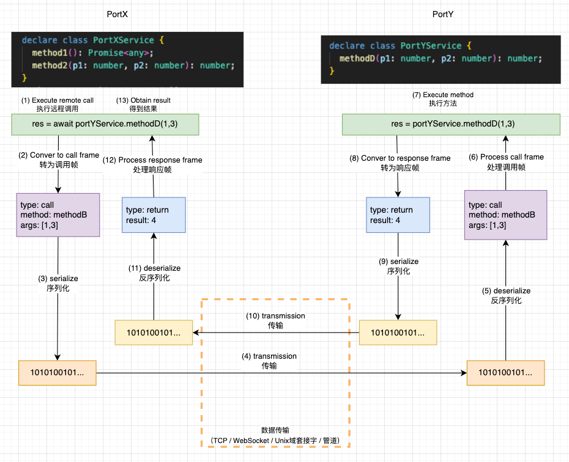

## CPCALL

A protocol independent library designed for remote procedure call (RPC) in JavaScript\
与协议无关的，为 JavaScript 设计的远程过程调用（RPC）的库

**目前版本不稳定，不遵循 semver 语义，可能会有较大的破坏性变更**\
**The current version is unstable and does not follow Semver semantics, which may result in significant destructive changes**

## Overview

[API](#api)
[Examples](#examples)

### Features

- 远程调用可操作代理对象，与原生 JavaScript 调用语法非常相近
- 与协议无关，可用于基于 TCP、IPC、WebSocket 等
- 双向远程调用
- 类型安全
- 数据传输默认采用 [JBOD](https://github.com/asnowc/jbod) 编码。相比 JSON，有如下优势：
  - 更多的数据类型。如 bigint、Set、Map、RegExp、Error、UInt8Array 等（查看[支持的数据类型](https://github.com/asnowc/jbod)），这意味着在调用远程方法时，你可以直接传递这些参数，而无需进行转换
  - 更小的数据大小。对于常见场景，编码后大小比 JSON 小得多，
- 无需定义数据结构，非常适合动态类型语言

### Usage

Node

`npm install cpcall`

```ts
import { createSocketCpc } from "cpcall/node";
import { createWebStreamCpc, createWebSocketCpc } from "npm:cpcall/web";
```

Deno

```ts
import { createWebStreamCpc, createWebSocketCpc } from "npm:cpcall/web";
```

Browser

```ts
import { createWebStreamCpc, createWebSocketCpc } from "https://esm.sh/cpcall@latest/web";
```

### Why

**什么是远程过程调用（RPC）？**

RPC（Remote Procedure Call Protocol）远程过程调用协议。
一个通俗的描述是：客户端可以直接调用远程计算机上的对象方法，并得到返回值，就像调用本地应用程序中的对象一样。

#### RPC 流程

下图为从 ProtX 调用远程端 PortY 的 PortYService.methodD() 方法的流程



#### 与 [tRpc](https://trpc.io/)、[gRpc](https://grpc.io/)、[socket.io](https://socket.io/) 有什么区别

与 tRpc、gRpc 最直接的一个区别是，tRpc、gRpc 都是通过客户端主动发起请求(调用)，服务端进行响应，的模式，他们只能单向发起调用。而 cpcall，可以进行双向相互调用

| 名称   | 基于协议             | 调用方向 |
| ------ | -------------------- | -------- |
| tRpc   | http                 | 单向调用 |
| gRpc   | http2                | 单向调用 |
| cpcall | 双向流（与协议无关） | 双向调用 |

socket.io 是一个基于 WebSocket 的库，可实现双端之间的双向实时通信，它提供了单播、多播等行为。使用它主要用到发布订阅模式。
而 cpcall，是一个端到端双向调用的 RPC 库。cpcall 与 socket.io 本质上不属于同一类型的库，但在 WebSocket 协议下，他们都能达到相似的行为。

## API

### cpcall/node

```ts
/* 创建一个基于 duplex 的 CpCall 实例。  */
export function createSocketCpc(duplex: Duplex): CpCall;
```

### cpcall/web

```ts
/* 创建一个基于 WebSocket 的 CpCall 实例。WebSocket 的状态必须是 open。 否则抛出异常  */
export function createWebSocketCpc(ws: WebSocket): CpCall;

/* 创建一个基于 WebStream 的 CpCall 实例。这可以是 Deno.Conn 对象 */
export function createWebStreamCpc(stream: {
  readable: ReadableStream<Uint8Array>;
  writable: WritableStream<Uint8Array>;
}): CpCall;
```

### cpcall 类型

#### CpCall

````ts
interface CpCall {
  /**
   * 设置可调用函数
   * @param cmd 方法名称
   * @param opts.this 函数执行时的 this 指向
   */
  setFn(cmd: any, fn: CmdFn, opts?: FnOpts): void;
  /** 删除可调用函数 */
  removeFn(cmd: any): void;
  /** 获取所有已设置的可调用函数，包括 setObject 设置的对象 */
  getAllFn(): IterableIterator<string>;
  /** 清空所有已设置的可调用函数，包括 setObject 设置的对象 */
  clearFn(): void;
  /** CpCaller 对象**/
  caller: CpCaller;
  /** CpCall 关闭事件. */
  readonly closeEvent: OnceListenable<void>;
  /** 向对方发送 disable 帧。调用后，对方如果继续发起远程调用，将会响应给对方异常\
   * 为保证连接能正常关闭，当不再提供调用服务时，应手动调用。 */
  disable(): Promise<void>;
  /**
   * 销毁连接
   * @returns 返回完全关闭后解决的 Promise
   */
  dispose(reason?: Error): void;

  /**
   * 根据对象设置调用服务。遍历对象自身和原型上值为function 类型的键，将其添加为函数服务*
   * @param obj 需要添加为服务的对象。
   * @param cmd 前缀
   */
  setObject(obj: object, cmd?: string): void;
  /**
   * 生成一个代理对象。
   * @returns 一个代理对象，其本质仍然是 caller.call()
   * @example
   * ```ts
   *  const service=cpcall.genCaller("pre")
   *  service.s1.get(1,2)  //等价于  cpcall.caller.call("pre.s1.get",1,2)
   * ```
   */
  genCaller(prefix?: string, opts?: GenCallerOpts): AnyCaller;
}
````

#### CpCaller

```ts
interface CpCaller {
  /** 调用远程设置的函数 */
  call(...args: any[]): Promise<any>;
  /** 调用远程设置的函数。与call不同的是，它没有返回值 */
  exec(...args: any[]): void;
  /**
   * 结束远程调用。
   * @param abort - 如果为true, 这将直接拒绝所有等待返回队列, 并将 ended 置为 3
   * @returns 当 ended 状态变为 3后解决的 Promise
   * */
  end(abort?: boolean): Promise<void>;
  /**
   * @remarks
   * 3: 表示已调用 end() 或已收到 disable 帧并且所有等待队列已清空
   * 2: 已收到 disable 帧. 后续不再会收到任何返回帧, 当前非异步返回的等待队列会被全部拒绝 (如果错误的收到了对方的返回帧, 会被丢弃)
   * 1: 已调用 end(). 当前不能再执行 exec() 或 call() 方法
   * 0: 当前可调用  */
  ended: 0 | 1 | 2 | 3;

  /** ended 变为 2 时触发 */
  disableEvent: OnceListenable<void>;
  /** ended 变为 3 时触发 */
  finishEvent: OnceListenable<void>;
}
```

##### RpcFrameCtrl

```ts
/** CpCall 构造函数依赖的接口。你可以实现自定义编解码器，或数据帧转发服务 */
export type RpcFrameCtrl<T = RpcFrame> = {
  /** 一个异步迭代器，它应迭代 cpcall 数据帧 */
  frameIter: AsyncIterable<T>;
  /** 当需要发送数据帧时被调用 */
  sendFrame(frame: T): void;
  /**
   * 在 closeEvent 发出前调用
   */
  close?(): Promise<void> | void;
  /**
   *  当用户手动调用 dispose() 时或迭代器抛出异常时调用
   */
  dispose?(reason?: any): void;
};
```

#### OnceEventTrigger

```ts
/** 一次性可订阅对象, 可通过 await 语法等待触发 */
interface OnceEventTrigger<T> {
  /** 订阅事件。如果事件已触发完成则抛出异常 */
  then(resolve: Listener<T>, reject: (data?: any) => void): void;
  /** 与 then 类似，它会返回 resolve 函数 */
  once<R extends Listener<T>>(resolve: R, reject?: (arg: any) => void): R;

  /** 这个是订阅 emitError() 触发的事件 */
  catch<R extends (reason: any) => void>(listener: R): void;
  /** 无论最终是 emit 还是 emitError. 都会被触发 */
  finally(listener: () => void): void;
  /**
   * 取消订阅事件
   * @returns 如果取消成功，则返回 true, 否则返回 false
   */
  off(key: object): boolean;
  /** 返回一个 promise，在emit() 后 resolve, 在 emit() Error 后 reject */
  getPromise(signal?: BaseAbortSignal): Promise<T>;
  /* 触发事件 */
  emit(arg: T): number;
  /* 以异常触发事件 */
  emitError(err: any): number;

  // 事件是否已经被触发
  done: boolean;
}
```

## Examples

### NodeJS TCP 的示例

服务端暴露了一些 API，客户端通过 TCP 连接服务端，然后调用它们

client.ts

```ts
import { createSocketCpc } from "cpcall/node";
import { Socket, connect } from "node:net";
import type { ServerApi } from "./server.js"; //导入服务端暴露 api 的类型

const socket = await connectSocket(7788, "localhost"); //创建 TCP 连接

const cpc = createSocketCpc(socket); //创建 cpc 实例
const serverApi = cpc.genCaller<ServerApi>(); //生成远程代理对象。传入类型，可获得完整类型提示

// 每秒调用一次远程方法 add, 并输出结果。 调用5次后结束
for (let i = 0; i < 5; i++) {
  const res = await serverApi.add(i, 5);
  console.log(res);
  await delay(1000);
}
await cpc.caller.end(); // 为了保证正常断开连接，需要手动调用 caller.end() 方法

function delay(time: number) {
  return new Promise((resolve) => setTimeout(resolve, time));
}

async function connectSocket(port: number, host?: string): Promise<Socket> {
  return new Promise(function (resolve) {
    const socket = connect({ port, host });
    socket.once("connect", () => resolve(socket));
  });
}
```

server.ts

```ts
import { Socket, createServer } from "node:net";
import { createSocketCpc } from "cpcall/node";

const server = createServer(onConnect);
server.listen(8888);

// 当客户端连接时的回调函数
function onConnect(socket: Socket) {
  const cpc = createSocketCpc(socket);
  cpc.caller.end(); //不需要调用客户端，为了保证后续正常断开连接，需要手动调用 caller.end() 方法
  cpc.closeEvent.then(() => console.log("cpc closed")); //连接关闭事件
  cpc.setObject(new ServerApi()); //暴露接口
}

// 这是暴露给客户端调用的类
class ServerApi {
  add(a: number, b: number) {
    const res = a + b;
    console.log(`${a} + ${b} = ${res}`);
    return res;
  }
}

export type { ServerApi }; //导出类型，以便客户端获得完整类型提示
```

### Deno TCP 示例

参考 NodJS TCP 示例。这里只展示了如何创建 CpCall 实例
server

```ts
import { createWebStreamCpc } from "npm:cpcall/web";

const server = Deno.listen({ port: 8888 });
for await (const conn of server) {
  const serverCpc = createWebStreamCpc(conn);
  // ...
}
```

client

```ts
import { createWebStreamCpc } from "npm:cpcall/web";

const conn = await Deno.connect({ port: 8888 });
const clientCpc = createWebStreamCpc(conn);
// ...
```

### 更多示例

[WebSocket 示例](./example/websocket/README.md): 前端暴露一些 API 给后端调用，同时后端也暴露一些 API 给前端调用\
[与 socket.io 的简单比较](./example/cpcall%20vs%20socket.io.md)\
自定义数据帧编解码器（文档待补充）\
实现一个基于 http 的 CpCall（文档待补充）

## 其他

[CPCALL 数据帧协议](./docs/frame_type.md)
