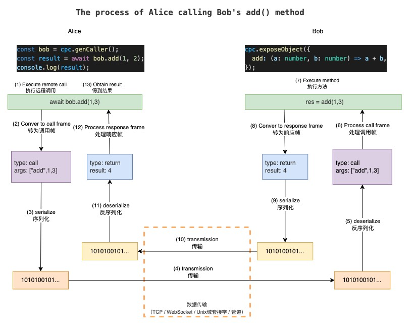

## CPCALL

与协议无关的，为 JavaScript 设计的远程过程调用（RPC）的库

**目前版本不稳定，不遵循 semver 语义，可能会有较大的破坏性变更**

## 概览

[api](#api)
[示例](#Usage)

### 特性

- 与协议无关，可用于基于 TCP、IPC、WebSocket 等
- 双向远程调用
- 类型安全
- 数据传输默认采用 [JBOD](https://github.com/asnowc/jbod) 编码。相比 JSON，有如下优势：
  - 更多的数据类型。如 bigint、Set、Map、RegExp、Error、UInt8Array 等，这意味着在调用远程方法时，你可以直接传递这些参数，而无需进行转换
  - 更小的数据大小。对于常见场景，编码后大小比 JSON 小得多，
- 无需定义数据结构，非常适合动态类型语言

## Why

#### 什么是远程过程调用（RPC）

RPC（Remote Procedure Call Protocol）远程过程调用协议。
一个通俗的描述是：客户端可以直接调用远程计算机上的对象方法，并得到返回值，就像调用本地应用程序中的对象一样。

##### RPC 流程

下图为从 ProtX 调用远程端 PortY 的 PortYService.methodD() 方法的流程



#### 与 [tRpc](https://trpc.io/)、[gRpc](https://grpc.io/)、[socket.io](https://socket.io/) 有什么区别

与 tRpc、gRpc 最直接的一个区别是，tRpc、gRpc 都是通过客户端主动发起请求(调用)，服务端进行响应，的模式，他们只能单向发起调用。而 cpcall，可以进行双向相互调用

| 名称   | 基于协议             | 调用方向 |
| ------ | -------------------- | -------- |
| tRpc   | http                 | 单向调用 |
| gRpc   | http2                | 单向调用 |
| cpcall | 双向流（与协议无关） | 双向调用 |

socket.io 是一个基于 WebSocket 的库，可实现双端之间的双向实时通信，它提供了单播、多播等行为。使用它主要用到发布订阅模式。
而 cpcall，是一个端到端双向调用的 RPC 库。cpcall 与 socket.io 本质上不属于同一类型的库，但在 WebSocket 协议下，他们都能达到相似的行为。

## Usage

首先定义服务

service_server.ts (运行在服务端，提供给客户端调用)

```ts
class SubService {
  //可以返回 Promise
  async mul(a: number, b: number) {
    await new Promise((resolve) => setTimeout(resolve, 1000)); /
    return a * b;
  }
}
export class ServerService {
  sub = new SubService();
  calc(a: number, b: number) {
    return a + b;
  }
  // 返回更复杂的数据类型
  getData() {
    return {
      regExp: /abc/,
      map: new Map([
        [1, 2],
        [3, 4],
      ]),
      set: new Set([1, 2, 3, 4]),
    };
  }
}
```

service_client.ts (运行在客户端，提供给服务端调用)

```ts
export class ClientService {
  getData(id: number) {
    return "ok" + id;
  }
}
```

#### 基于 TCP 的示例

##### Node

server.ts

```ts
import { createServer } from "node:net";
import { createSocketCpc } from "cpcall/node";
import { ServerService } from "./service_server.js";
import type { ClientService } from "./service_client.js"; //仅导入类型

const server = createServer(async (socket) => {
  const serverCpc = createSocketCpc(socket);
  serverCpc.setObject(new ServerService()); //设置服务，供客户端调用
  const caller = serverCpc.genCaller<ClientService>(); //配置类型，获取客户端完整的类型提示

  const msg = await caller.getData(8); //调用客户端函数
  console.log("server", msg);

  await serverCpc.caller.end(); //结束调用
});
server.listen(8888);
```

client.ts

```ts
import { connect } from "node:net";
import { createSocketCpc } from "cpcall/node";
import type { ServerService } from "./service_server.js"; //仅导入类型
import { ClientService } from "./service_client.js";

const clientSocket = connect({ port: 8888, host: "127.0.0.1" });

clientSocket.on("connect", async () => {
  const clientCpc = createSocketCpc(clientSocket);
  clientCpc.setObject(new ClientService()); //客户端设置服务，可由服务端主动调用

  const caller = clientCpc.genCaller<ServerService>(); //配置类型，获取服务端完整的类型提示
  const data1 = await caller.getData(); //调用服务端函数
  console.log("client", data1);
  const data2 = await caller.sub.mul(3, 5); //15
  console.log("client", data2);

  await clientCpc.caller.end(); //结束调用
});
clientSocket.on("close", () => console.log("client close"));
```

##### Deno

server

```ts
import { createWebStreamCpc } from "npm:cpcall/web";

const server = Deno.listen({ port: 8888 });
for await (const conn of server) {
  const serverCpc = createWebStreamCpc(conn);
  // ...
}
```

client

```ts
import { createWebStreamCpc } from "npm:cpcall/web";

const conn = await Deno.connect({ port: 8888 });
const clientCpc = createWebStreamCpc(conn);
// ...
```

#### 基于 WebSocket 的实例

浏览器客户端：

```ts
import { createWebSocketCpc } from "https://esm.sh/cpcall@latest/web";

function connectWs() {
  return new Promise<WebSocket>(function (resolve, reject) {
    const ws = new WebSocket("ws://localhost:7770");
    ws.onopen = () => resolve(ws);
  });
}
const ws = await connectWs();
const clientCpc = createWebSocketCpc(ws);

// ...
```

## API

#### cpcall/node

```ts
export function createSocketCpc(duplex: Duplex): CpCall;
```

#### cpcall/web

```ts
export function createWebSocketCpc(ws: WebSocket): CpCall;

export function createWebStreamCpc(stream: {
  readable: ReadableStream<Uint8Array>;
  writable: WritableStream<Uint8Array>;
}): CpCall;
```

#### 类型

````ts
interface CpCall {
  /**
   * @remarks 设置函数服务，设置后，可由对方调用
   * @param cmd 方法名称
   * @param opts.this 函数执行时的 this 指向
   */
  setFn(cmd: any, fn: CmdFn, opts?: FnOpts): void;
  /** @remarks 删除函数服务 */
  removeFn(cmd: any): void;
  /** @remarks 获取所有已设置的函数 */
  getAllFn(): IterableIterator<string>;
  /** @remarks 清空所有已设置的函数 */
  clearFn(): void;
  /** @remarks CpCaller 对象**/
  caller: CpCaller;
  /** @remarks CpCall 关闭事件. */
  readonly closeEvent: OnceEventTrigger<void>;
  /** @remarks 向对方发送 disable 帧。调用后，对方如果继续发起远程调用，将会响应给对方异常 */
  disable(): Promise<void>;
  /**
   * @remarks 销毁连接
   * @returns 返回完全关闭后解决的 Promise
   */
  dispose(reason?: Error): void;

  /**
   * @remarks 根据对象设置调用服务。遍历对象自身和原型上值为function 类型的键，将其添加为函数服务*
   * @param obj 需要添加为服务的对象。
   * @param cmd 前缀
   */
  setObject(obj: object, cmd?: string): void;
  /**
   * @remarks 生成一个代理对象。
   * @returns 一个代理对象，其本质仍然是 caller.call()
   * @example
   * ```ts
   *  const service=cpcall.genCaller("pre")
   *  service.s1.get(1,2)  //等价于  cpcall.caller.call("pre.s1.get",1,2)
   * ```
   */
  genCaller(prefix?: string, opts?: GenCallerOpts): AnyCaller;
}

interface CpCaller {
  /** @remarks 调用远程设置的函数 */
  call(...args: any[]): Promise<any>;
  /** @remarks 调用远程设置的函数。与call不同的是，它没有返回值 */
  exec(...args: any[]): void;
  /**
   * @remarks 结束远程调用。
   * @param abort - 如果为true, 这将直接拒绝所有等待返回队列, 并将 ended 置为 3
   * @returns 当 ended 状态变为 3后解决的 Promise
   * */
  end(abort?: boolean): Promise<void>;
  /**
   * @remarks
   * 3: 表示已调用 end() 或已收到 disable 帧并且所有等待队列已清空
   * 2: 已收到 disable 帧. 后续不再会收到任何返回帧, 当前非异步返回的等待队列会被全部拒绝 (如果错误的收到了对方的返回帧, 会被丢弃)
   * 1: 已调用 end(). 当前不能再执行 exec() 或 call() 方法
   * 0: 当前可调用  */
  ended: 0 | 1 | 2 | 3;

  /**
   * @remarks ended 变为 2 时触发
   */
  disableEvent: OnceEventTrigger<void>;
  /**
   * @remarks ended 变为 3 时触发
   */
  finishEvent: OnceEventTrigger<void>;
}
````

```ts
type RpcFrameCtrl<T = RpcFrame> = {
  frameIter: AsyncIterable<T>;
  sendFrame(frame: T): void;
  /**
   * @remarks 在 closeEvent 触发前调用
   */
  close?(): Promise<void> | void;
  /**
   *  @remarks  当用户手动调用 dispose() 时或迭代器抛出异常时调用
   */
  dispose?(reason?: any): void;
};
```

## 其他

[CPCALL 数据帧协议](./docs/frame_type.md)

### 更多示例

自定义数据帧编解码器（文档待补充）
实现一个基于 http 的 CPCALL（文档待补充）
